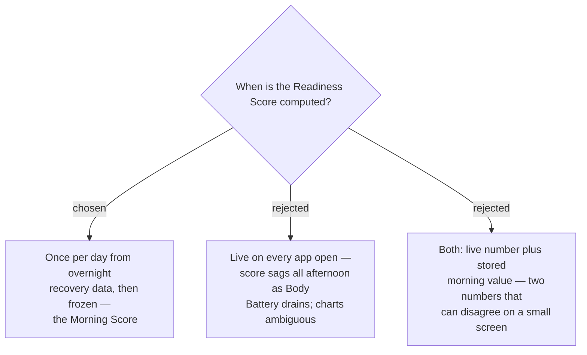

# Readiness Score is a once-daily morning snapshot, not a live value

Readiness is a claim about the wearer's recovered state *before* training, so a
value that falls through the day as Body Battery drains would advise REST every
afternoon regardless of actual recovery. Computing once per day also yields
exactly one Daily Record per day, which is the natural unit for the 7-day,
30-day and 8-week history screens.

## Consequences

The score must be **persisted** by the app — it cannot be recomputed on demand,
because Connect IQ's `SensorHistory` only reaches back to the last power cycle
and cannot reproduce a past morning. This makes the app's own storage the source
of truth for all history, and forces an explicit rule for days the app never ran.
