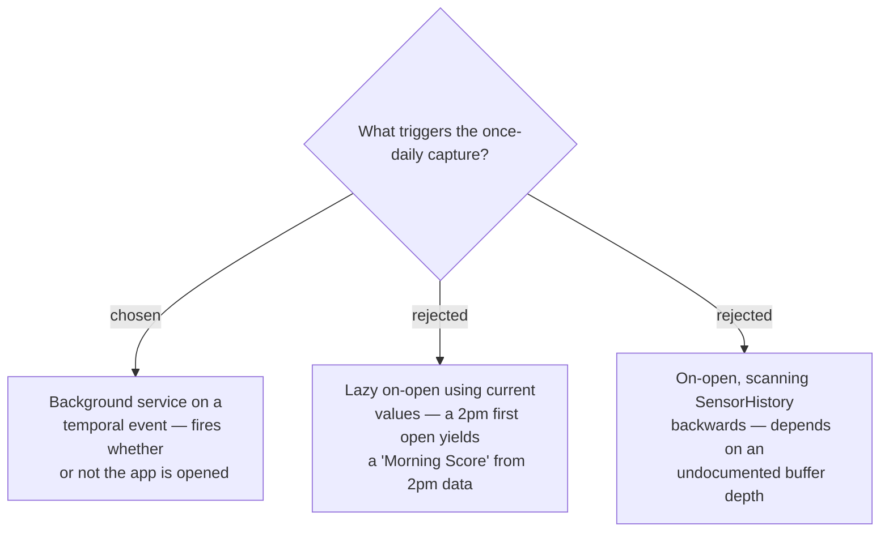

# A background temporal event captures the Daily Record

The product promise is a *Morning* Score, so the capture cannot depend on when
the wearer happens to open the app. A background temporal event captures the
Daily Record unattended, which also keeps the history screens gap-free on days
the app is never opened.

## Consequences

Verified Connect IQ constraints that shape the implementation:

- Temporal events cannot recur **more often than every 5 minutes**.
- **Only one temporal event may be registered at a time** — `registerForTemporalEvent`
  overwrites any previous registration, so there is exactly one scheduled slot.
- `Background.exit()` payloads are capped at **approximately 8 KB**
  (`ExitDataSizeLimitException`), enough for one day's score but not for history.
- Exit data is delivered to the app immediately if it is running, otherwise saved
  for its next run, so a capture is not lost when the app is closed.
- The app requires the **Background** permission.

**Unverified:** the memory ceiling for a background process. A 32 KB figure is
widely repeated in the community but was not confirmed in Garmin's documentation.
Confirm against the SDK before sizing the capture logic.
