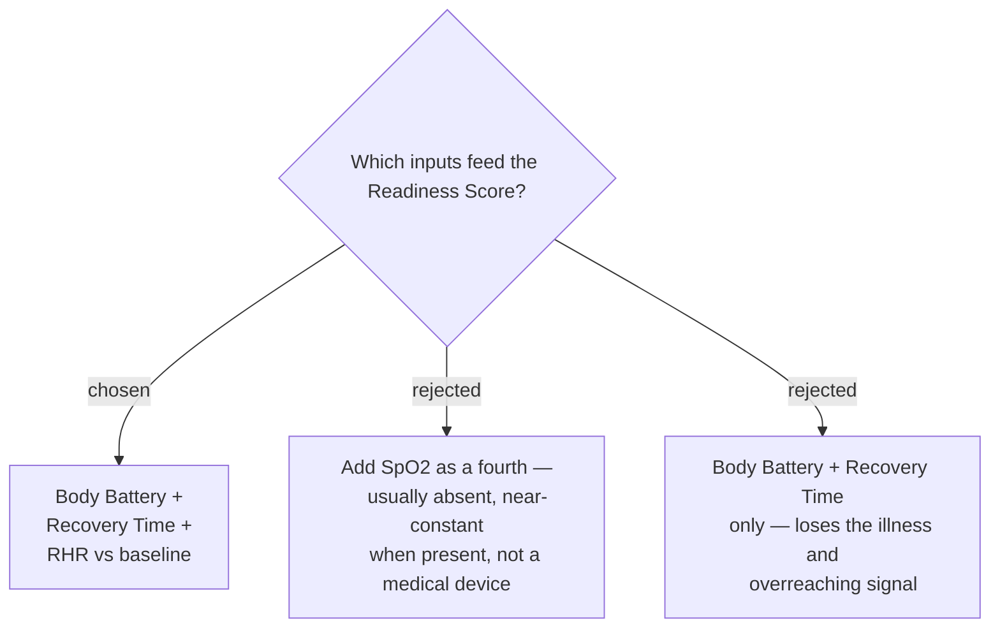

# The Readiness Score uses three inputs; SpO2 is excluded

Each chosen input carries signal the others do not: Body Battery already folds in
HRV, stress, sleep quality and accumulated load; `timeToRecovery` adds acute
training load from the last activity; and resting heart rate measured against its
own baseline catches illness and overreaching that Body Battery can miss.

## Considered options

SpO2 was rejected despite appearing in comparable apps. It is only sampled
continuously when the wearer enables pulse-oximeter sleep tracking, which is off
by default and costs battery, so for most users there is no data at all. When
there is, a healthy wearer at low altitude sits at 95–99% nightly — near-zero
variance, contributing almost nothing to a 0–100 score while forcing null-handling
throughout. Garmin also states the pulse oximeter is not a medical device, which
makes it the weakest possible basis for advising training intensity.

## Consequences

- Screen 2's four sub-dials become **three** Component Scores, so that layout
  changes from the reference screenshots.
- All three inputs are confirmed reachable on the Forerunner 165 (API 5.2):
  `SensorHistory.getBodyBatteryHistory()` (3.3.0),
  `ActivityMonitor.Info.timeToRecovery` (3.3.0),
  and `UserProfile.Profile.restingHeartRate` / `averageRestingHeartRate`
  (1.0.0 / 3.2.0).
- Because `timeToRecovery` is available at this API level, the "Vigorous minutes"
  fallback used by older comparable apps is unnecessary.
- **Unverified:** the averaging window behind `averageRestingHeartRate`. It is
  assumed to be a multi-day baseline; confirm before describing it as "7-day".
