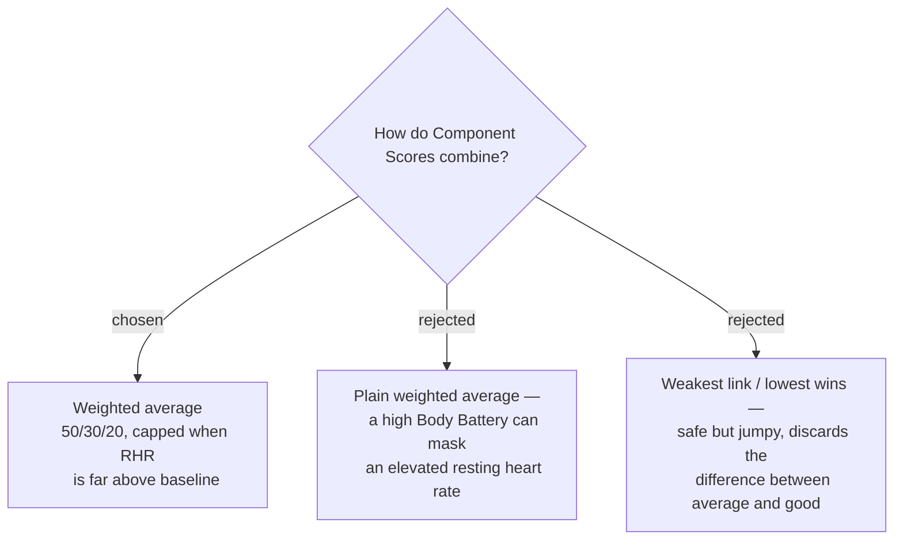

# Readiness Score is a weighted average with a resting-heart-rate override

A plain average buries the signal that matters most: Body Battery 85, Recovery 90
and a resting heart rate 8 bpm above baseline averages out to roughly 82 — GO HARD
— on a morning when the wearer is most likely getting ill. Resting heart rate
therefore acts as a **tripwire rather than a slider**: it takes only a 20% share of
the average so ordinary day-to-day wobble does not jerk the score around, and a
large deviation instead vetoes the result outright.

## The formula

Component Scores, each normalised to 0–100:

| Component | Source | Normalisation |
|---|---|---|
| Body Battery | `getBodyBatteryHistory()` at wake | used directly (already 0–100) |
| Recovery | `Info.timeToRecovery` (hours) | `100 − (hours / 48 × 100)`, clamped 0–100 |
| Resting HR | `restingHeartRate` vs `averageRestingHeartRate` | `100 − (delta_bpm × 8)`, clamped 0–100 |

Readiness Score = `0.50 × BodyBattery + 0.30 × Recovery + 0.20 × RHR`

**Override:** if today's resting heart rate is **≥ 7 bpm above** the RHR Baseline,
the Readiness Score is capped at 59 (the GO EASY ceiling). At **≥ 12 bpm above**, it
is capped at 39 (the REST ceiling).

All five constants — the 48-hour recovery span, the ×8 RHR slope, the two override
thresholds, and the three weights — are **starting values chosen for plausibility,
not derived from data**. They are expected to be tuned once real Daily Records
exist, and should live as named constants rather than inline literals.

## Two unverified assumptions the thresholds rest on

Both concern resting heart rate, and both were checked against Garmin's documentation
without resolution:

1. **`averageRestingHeartRate` window.** Assumed to be a multi-day baseline. If it is
   in fact very short, the +7 and +12 thresholds compare today against something too
   close to today, and the override would rarely fire.
2. **`restingHeartRate` freshness.** Assumed to reflect the night just ended. If it
   lags by a day, the override fires a day late — an illness signal arriving the
   morning *after* the one that mattered.

Neither is resolvable from the docs. Both should be confirmed empirically against a
real device before the constants are tuned, and until then the override should be
treated as directionally right rather than precisely calibrated.

## Consequences

The override means the Readiness Score is not a pure function of the three
Component Scores — a screen showing all three dials can display values whose
weighted average does not equal the headline number. The UI must not imply
otherwise, and the override firing is worth surfacing to the wearer so the
discrepancy reads as deliberate rather than as a bug.
