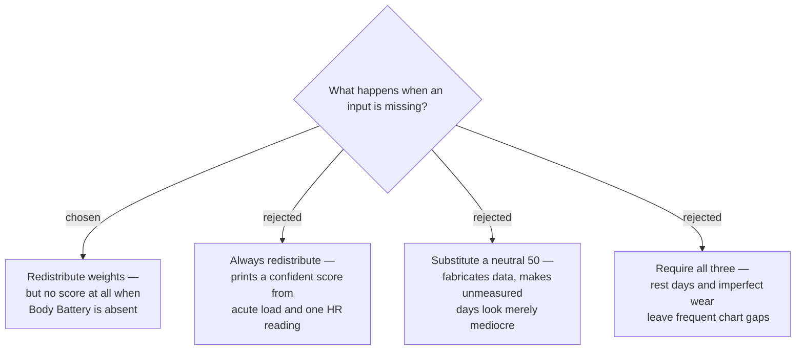

# Missing inputs redistribute, except Body Battery which suppresses the score

A missing Recovery or RHR component is dropped and the remaining weights are
renormalised, so the Readiness Score stays a genuine 0–100 derived from real
data. Body Battery is treated differently: it carries 50% of the weight *and* the
entire HRV, sleep-quality and stress signal, so a score computed without it is not
a degraded readiness measurement but a substantially different and weaker one
wearing the same name and colour band.

## `timeToRecovery` of zero is not missing data

Zero hours outstanding means fully recovered and maps to a Component Score of
**100**. Only a genuine `null` counts as absent. Conflating the two would penalise
every rest day — exactly inverting the intended meaning.

## The override cannot fire without RHR

When RHR is absent, ADR 0004's safety override is **inoperative** — it is defined
entirely in terms of the deviation from the RHR Baseline, and there is no deviation
to measure. This is correct rather than a gap: an override that fired on absent data
would be inventing a verdict. But it means the design's one safety mechanism is
silently missing on those days.

Because it is silent, an RHR-less Readiness Score is **marked the same way a stale
score is** (ADR 0009): the number is shown, but without its Status Band colour, so it
never carries advice the app could not actually check.

## Consequences

- Renormalisation divides each surviving weight by their sum. Stated exactly, to
  avoid a rounded percentage being reimplemented two different ways:

  | Absent | Surviving weights |
  |---|---|
  | Recovery | Body Battery `50/70`, RHR `20/70` |
  | RHR | Body Battery `50/80`, Recovery `30/80` |

- With RHR absent the override also does not run, so the score is shown uncoloured.
- With Body Battery absent, **no Daily Record is written** and the day is a gap in
  the history screens. The app should say why — an unworn watch is a user-fixable
  cause, and silence would read as a bug.
