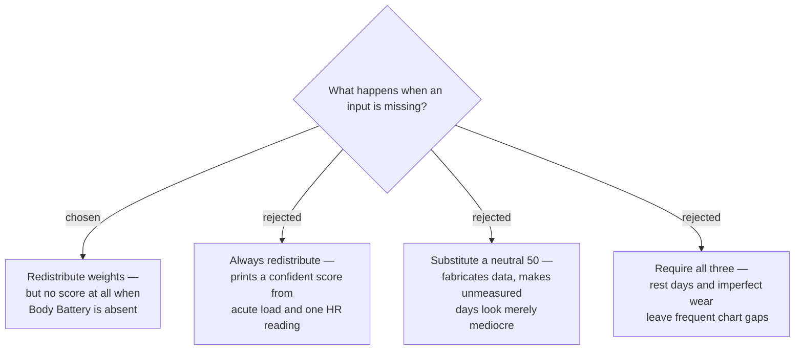

# Missing inputs redistribute, except Body Battery which suppresses the score

A missing Recovery or RHR component is dropped and the remaining weights are
renormalised, so the Readiness Score stays a genuine 0–100 derived from real
data. Body Battery is treated differently: it carries 50% of the weight *and* the
entire HRV, sleep-quality and stress signal, so a score computed without it is not
a degraded readiness measurement but a substantially different and weaker one
wearing the same name and colour band.

## `timeToRecovery` of zero is not missing data

Zero hours outstanding means fully recovered and maps to a Component Score of
**100**. Only a genuine `null` counts as absent. Conflating the two would penalise
every rest day — exactly inverting the intended meaning.

## Consequences

- With Recovery absent, weights renormalise to Body Battery 71% / RHR 29%.
- With RHR absent, they renormalise to Body Battery 63% / Recovery 37%.
- With Body Battery absent, **no Daily Record is written** and the day is a gap in
  the history screens. The app should say why — an unworn watch is a user-fixable
  cause, and silence would read as a bug.
