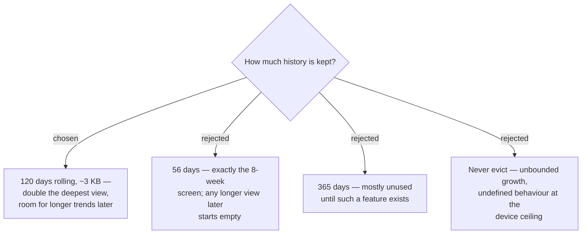

# Retain 120 Daily Records; missing days break the chart line

History cannot be backfilled. Retaining only what today's screens display means a
longer view added later ships empty and takes months to populate, whereas
over-retaining costs a few kilobytes on a device that has them. A Daily Record is
a date, a Readiness Score and three Component Scores — roughly 25 bytes — so 120
days is about 3 KB. Records are evicted oldest-first as new ones arrive.

## Storage layout and the day key

The 120 records live in **one Storage value holding an array**, not 120 separate
keys. Individual Storage values are capped at **32 KB**, so a ~3 KB array sits
comfortably inside one value, and oldest-first eviction becomes a single
read-modify-write instead of an enumeration over an unbounded key space.

Records are keyed by the **device-local date at the moment of Capture**. A wearer
crossing a timezone may therefore produce a duplicate or skip a day. This is
accepted: the alternative is storing UTC and reinterpreting it for display, which
moves the same ambiguity somewhere less visible.

**Unverified:** the total Object Store budget on the Forerunner 165 — Garmin states
it "can vary between devices". The 32 KB per-value cap is confirmed and is not the
binding constraint here.

## Missing days break the line

A day with no Daily Record renders as a **break in the chart line** — never
interpolated across, never plotted as zero. A gap means "not measured", which is a
different claim from "readiness was low"; plotting zero would draw a dramatic red
crash on a morning the wearer simply did not wear the watch.
