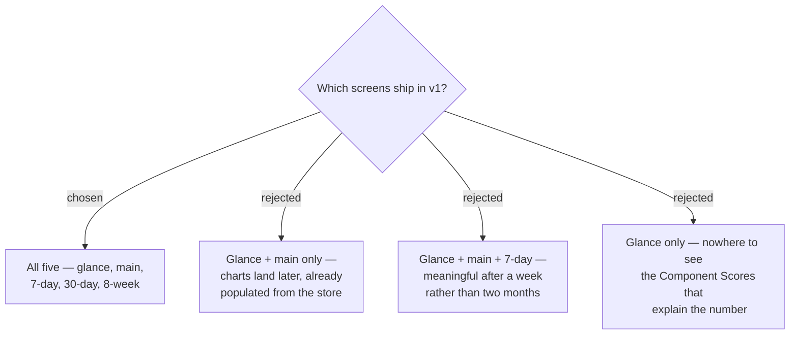

# All five screens ship in v1

> **Superseded.** The three history screens were cut in
> [ADR-0011](./0011-cut-history-screens-keep-the-store.md); the Capture and the
> 120-record store were kept. The reasoning below is retained as the record of why
> all five were originally in scope.

The full five-screen set ships in v1: glance card, main score screen, and the
7-day, 30-day and 8-week history views.

## The accepted tradeoff

Because the background capture and the 120-day store are complete in v1 either
way, deferring the chart screens would have cost nothing in data — they would have
shipped later already populated. Shipping them now instead means the **30-day and
8-week screens display almost nothing for the first one to two months** of a fresh
install, and the 8-week grid needs 56 Daily Records before it is fully meaningful.

This was chosen deliberately: a complete screen set makes the app whole on the
store listing and in the hands of a first user from day one, which was judged to
outweigh the empty early views. Each chart must therefore degrade gracefully when
it has fewer records than it can display, rather than assuming a full window.
