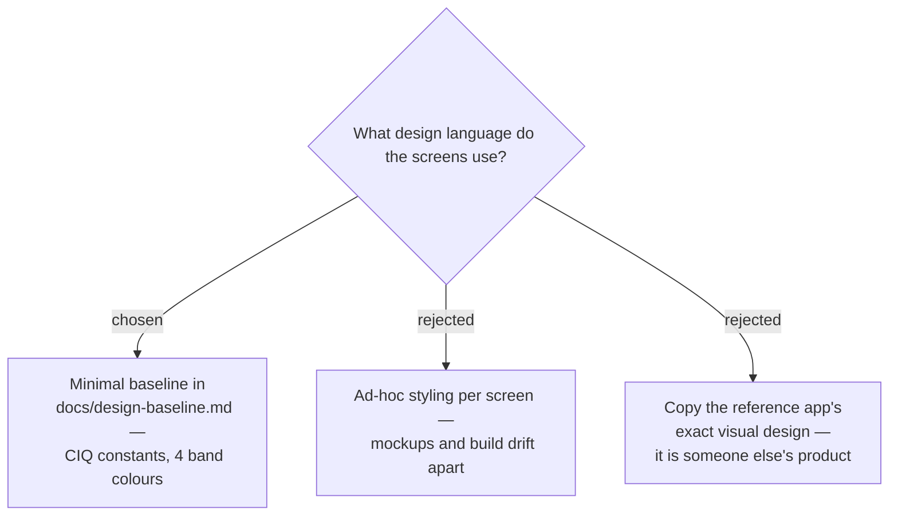

# A minimal design baseline is established before any mockup

The project had no design system, so one was established before rendering any
mockup: a fixed 390 × 390 round canvas, pure black background, four Status Band
colours, a Connect IQ font mapping, and four components (score arc, Component dial,
gradient bar, chart). It lives at [`docs/design-baseline.md`](../design-baseline.md)
and is the anchor the implementation inherits.

## Why pure black specifically

The Forerunner 165 has an **AMOLED** panel, where a black pixel is an unlit pixel.
Pure `#000000` is therefore simultaneously the highest-contrast background and the
lowest-power one. A near-black such as `#111111` would light every pixel on screen
for no visual gain — a meaningful cost on a watch whose battery life is a headline
feature.

## Consequences

Tokens are expressed as Connect IQ constants (`FONT_NUMBER_THAI_HOT`, `FONT_XTINY`,
…) rather than pixel sizes, because Monkey C selects the face and exact metrics vary
by device. This keeps the baseline honest about what the platform can actually draw
instead of describing a web page that would then need reinterpreting.
