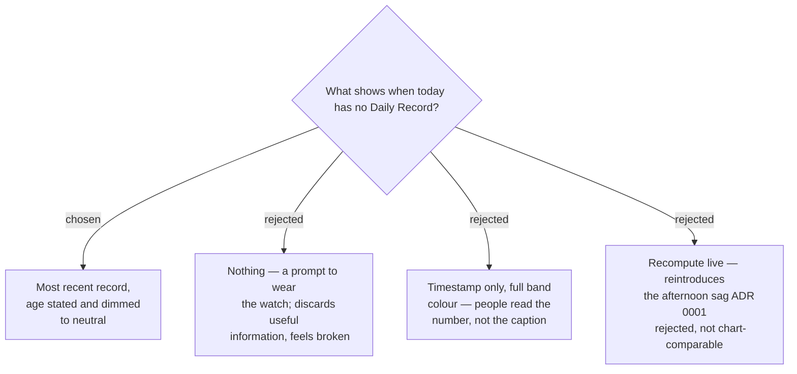

# A score older than today is shown, but marked stale

The background Capture can miss a morning for ordinary reasons: the watch on a
charger, a flat battery, or an unworn wrist leaving Body Battery absent, which
under ADR 0005 writes no Daily Record at all. Left as designed, the main screen
would show the last score with nothing indicating its age — a bright green 84 read
as this morning's when it is thirty hours old.

The defect is not showing stale data; it is showing it **unlabelled**. So the most
recent Daily Record is still displayed, with its age stated ("2 days ago") and the
score rendered in the `Secondary text` neutral instead of its Status Band colour, so
it reads as a record rather than as advice.

## Consequences

- Every score-bearing surface — the glance card and the main screen — needs a
  **second visual state**. A Stale Score must be unmistakable at a glance, not
  merely annotated, because the number is what gets read.
- The Status Band colour is deliberately withheld while stale. Colour carries
  advice in this design (ADR 0008), so a stale score has no business wearing it.
- The history screens are unaffected: they already show gaps honestly (ADR 0006).
