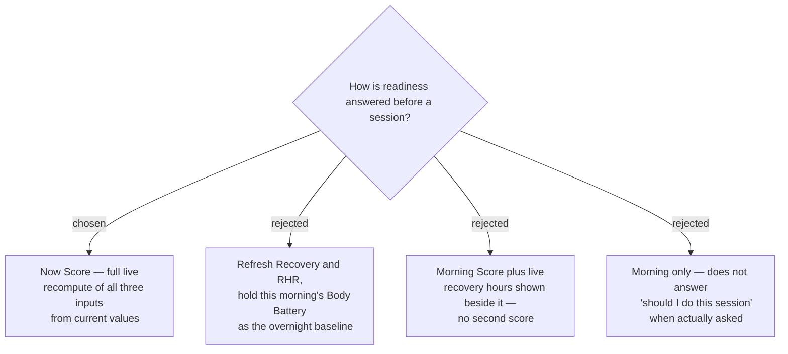

# A live Now Score is computed on demand, alongside the Morning Score

A Morning Score is twelve hours stale by an evening session, so the app computes a
**Now Score** on demand at the moment the wearer asks.

## Only two of the three inputs actually change

`restingHeartRate` is a **daily** value derived from overnight data — a profile
field, not a sensor read — so it cannot differ between the morning Capture and an
evening Now Score. The Now Score therefore re-reads **Body Battery and
`timeToRecovery`**; RHR is carried over unchanged from the same daily value the
Morning Score used.

This sharpens what the Now Score is. It is not "live data disagreeing with the
morning" — it is exactly two inputs moving, one of which moves by the clock.

## The accepted tradeoff

Body Battery drains through the day by the clock, not by fatigue. A Body Battery of
45 at 18:00 does not mean the wearer is unrecovered — it means it is 18:00. Feeding
it into the same formula as a morning reading of 88 compares two different
quantities, so **the Now Score will read lower in the evening for reasons unrelated
to readiness**, and lower still the later it is asked.

This was chosen deliberately over the alternative of holding the morning Body
Battery constant. The consequence is accepted: the Now Score answers "what do my
metrics say right now", not "how does this compare with how I woke up".

## Consequences

- **A Now Score is never written as a Daily Record.** Only Morning Scores are
  stored. Mixing the two would plot incompatible measurements on one axis and make
  the history charts meaningless.
- The two scores must be **visually and verbally distinct** on screen. A wearer who
  reads an evening Now Score as though it were a Morning Score will conclude they
  are less recovered than they are.
- Because the evening drop is expected rather than exceptional, the UI should not
  present a low Now Score with the same alarm as a genuinely low Morning Score.
- The Status Band thresholds were chosen against morning readings. They are applied
  unchanged to the Now Score, which is part of why it skews low later in the day.
