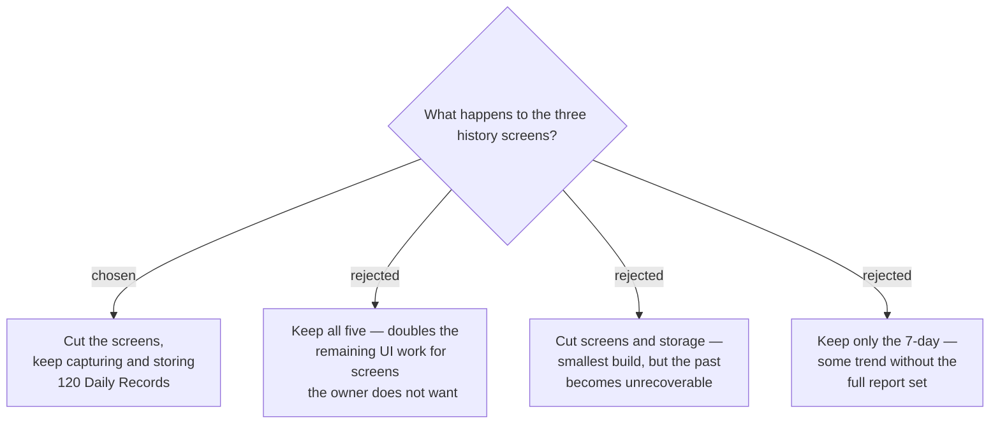

# The history screens are cut from v1; the store stays

v1 ships the glance card, the main Morning Score screen and the Now Score. The
7-day, 30-day and 8-week views are cut. The background Capture and the 120-record
store are **unchanged** and keep running.

## Why the split

Screens and data are separable, and they have opposite economics. The three chart
screens are roughly half the remaining UI work — three layouts, gap rendering,
weekly averaging, axis scaling — and buy nothing if nobody opens them. The store
costs about 3 KB and no screen work at all.

The asymmetry from ADR 0006 decides it: a chart screen can be added at any time,
but the past cannot. Keeping the store means a trend view added months from now
opens already populated; dropping it would mean starting from zero on that day.

## Consequences

- ADR 0007 is superseded. Its accepted cost — near-empty 30-day and 8-week screens
  for the first months — no longer applies, because those screens do not ship.
- ADR 0006 stands in full. The 120-record retention and the rule that missing days
  break the line remain in force; the line-breaking rule is simply dormant until a
  chart screen exists to draw it.
- The five-screen mockup is now partly ahead of the design: screens 3–5 are
  deferred, and the Now Score screen it does not yet show is in scope.

## The store must not be shipped untested

Cutting the screens leaves the store with **no reader in v1** — nothing but ADR 0009's
stale-check, which touches only the most recent record. A defect in the write or
eviction path would therefore go undetected for months, silently corrupting the one
asset that cannot be rebuilt. That would defeat the entire reason for keeping it.

v1 must therefore include **unit tests over the Daily Record store**: write, read
back, the 120-record eviction boundary, and the no-record-for-today case. This is the
condition on which keeping an unread store is justified.
