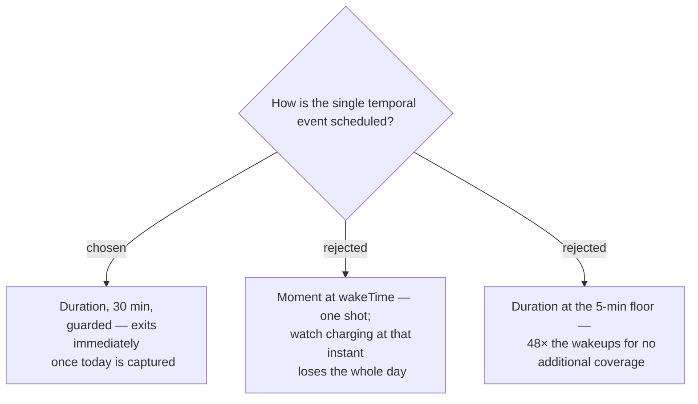

# The Capture runs on a 30-minute Duration event behind a cheap guard

`registerForTemporalEvent` offers exactly one slot and overwrites any previous
registration (ADR 0002), so the schedule is a single load-bearing choice rather
than something an implementer can hedge. It is registered as a **`Duration` of 30
minutes**, repeating.

## The guard is what makes this affordable

Nearly every firing must cost almost nothing. On each wake, in order:

1. If a Daily Record already exists for today → **exit immediately**.
2. If the current time is before `Profile.wakeTime` → **exit immediately**.
3. Otherwise attempt the Capture (ADR 0013), then exit.

Only the first firing after wake does real work. The rest are two comparisons and
an exit, so the ~48 daily wakeups cost far less than the arithmetic suggests.

## Why not the one-shot Moment

A `Moment` registered at `wakeTime` is the obvious cheap answer and was rejected on
a specific failure: a watch on the charger, powered off, or simply not worn at that
instant misses its only chance and loses the day entirely. Because history cannot be
backfilled (ADR 0006), a missed firing is permanent. A repeating window that keeps
trying until it succeeds is worth the wakeups.

## Consequences

- The Capture happens within 30 minutes of `wakeTime`, not at it. ADR 0013 is what
  keeps the *value* anchored to wake despite the *firing* being later.
- The 5-minute floor is never approached, so no risk of a rejected registration.
- Registration must be re-established on app install and after any device reset;
  losing the single slot silently stops all Captures.
