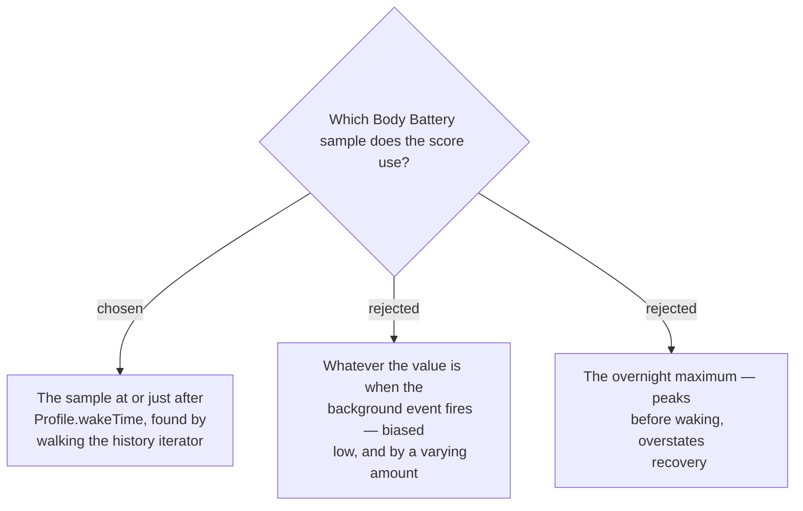

# Body Battery is resolved at wake time, not at Capture time

Body Battery carries 50% of the Readiness Score, and it begins draining the moment
the wearer is up. Because the Capture fires up to 30 minutes after `wakeTime`
(ADR 0012), reading the *current* value would bias every Morning Score low — and by
a different amount each day, depending on how soon after waking the event happened.
That variance is worse than the bias: it makes scores incomparable across days,
quietly corrupting the very history the store exists to preserve.

## The mechanism

1. Read `Profile.wakeTime` and resolve it to today's `Time.Moment`.
2. Open `SensorHistory.getBodyBatteryHistory()`.
3. **Guard:** if `getOldestSampleTime()` is later than the wake Moment, the buffer no
   longer reaches back to wake → **write no Daily Record**, consistent with ADR 0005's
   "no Body Battery, no score".
4. Otherwise walk the iterator to the first sample at or after the wake Moment and
   use that value.

Step 3 is the important one. `SensorHistoryIterator` exposes `getOldestSampleTime()`
and `getNewestSampleTime()`, so **buffer depth is interrogable at runtime** rather
than assumed. The undocumented buffer size stops being a gamble: the app asks
whether it has the data it needs and declines to guess when it does not.

## Consequences

- `Profile.wakeTime` is a configured setting, not observed wake. A wearer whose real
  wake time differs sharply from their configured one gets a Body Battery reading
  from the wrong moment. This is accepted — the API exposes no observed wake time at
  API 5.2 (`upcomingWakeTime` is 6.0.0 and out of reach).
- A wearer who never configures a wake time falls back to the device default, which
  may not resemble their schedule.
- The Now Score is unaffected: it deliberately reads current Body Battery, which is
  the whole point of ADR 0010 and the source of its accepted evening skew.
