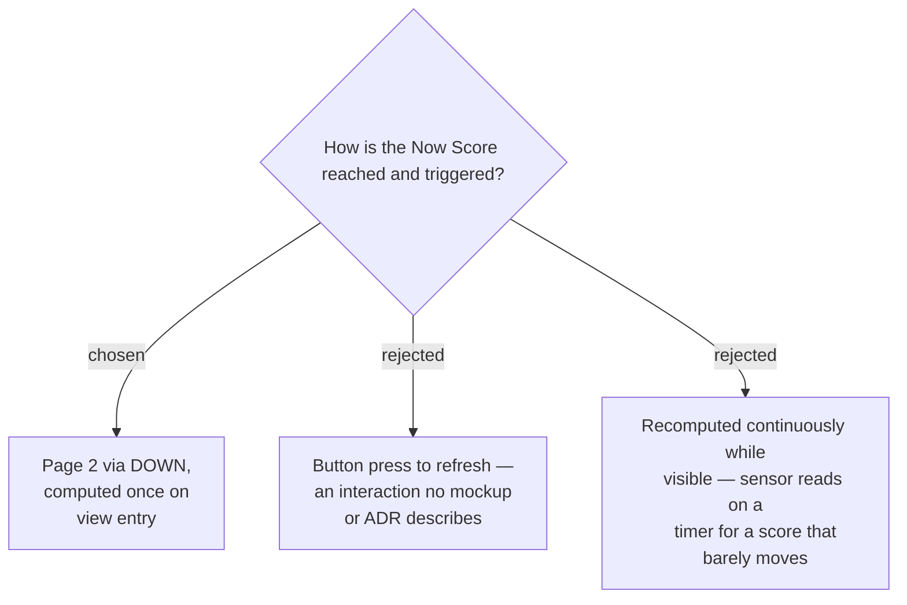

# Two pages; the Now Score is computed on view entry

ADR 0011 puts three surfaces in v1 but never says how they relate. They are:

- **Glance card** — swipe-up, always the Morning Score (ADR 0009 stale rules apply).
- **Page 1** — Morning Score, the app's landing page.
- **Page 2** — Now Score, reached by `DOWN` from page 1.

The Now Score is computed **once, on entry to page 2**, and its timestamp shows the
moment of that computation.

## Why on entry rather than on a button

"On demand" in ADR 0010 was ambiguous between a page visit and an explicit refresh.
Computing on entry makes paging down *be* the demand — there is nothing to learn and
no second interaction to discover. The visible timestamp is what keeps it honest: the
wearer can always see how old the number is, so a stale-by-a-few-minutes value never
misleads.

Continuous recomputation while the page is visible was rejected as pure cost. Body
Battery and `timeToRecovery` move on the order of minutes to hours; re-reading them
on a timer would drain battery to animate a number that is not changing.

## Consequences

- Leaving page 2 and returning recomputes. Two visits a minute apart can differ, which
  the timestamp explains.
- The glance never shows a Now Score. A glance is passive — the wearer did not ask a
  question, so answering one would misrepresent a drained evening Body Battery as a
  readiness verdict.
- Page 2 does a sensor read on navigation, so it is the one screen whose entry is not
  free. Acceptable for a screen reached deliberately.
