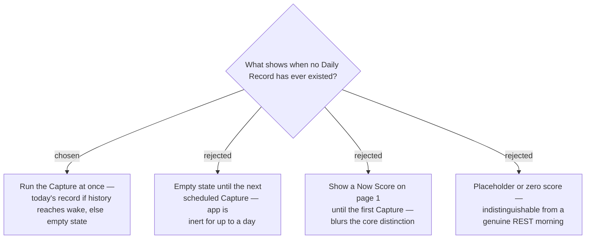

# First run attempts an immediate Capture before showing an empty state

A fresh install has no Daily Record at all, and this is the state **every user sees
first**. It is not a stale score: there is no age to report and nothing to dim, so
ADR 0009's treatment does not apply.

## Try before giving up

On first launch — and any launch finding no record for today — the app runs the
**Capture immediately** rather than waiting for the next temporal event. The
mechanism already exists (ADR 0013): resolve `Profile.wakeTime`, check
`getOldestSampleTime()`, and read the Body Battery sample at wake.

Install at 09:00 and the history very likely still reaches back to a 06:30 wake, so
the app has a genuine Morning Score within seconds of install and the empty state is
never seen. Install at 23:00 and the buffer will not reach that morning, so it
declines and shows the empty state — correctly, because it genuinely does not know.

This adds no new mechanism. It reuses the Capture path and simply stops assuming the
scheduled event is the only chance to run it.

## The empty state, when it is reached

No number, no arc fill, no band colour — a placeholder or a zero would be
indistinguishable from a genuine REST morning. Just the caption
**`FIRST SCORE TOMORROW MORNING`**.

Showing a Now Score on page 1 instead was rejected: the Morning/Now distinction is
what the whole design rests on (ADR 0010), and blurring it on the app's first screen
teaches the wrong model from the first second. Page 2 already offers a Now Score to
anyone who wants a number immediately.

## Consequences

- The empty state is a **third** visual state, distinct from both coloured and
  uncoloured. It carries no number, so it cannot be confused with a low score.
- A launch-triggered Capture may race the scheduled one. The "does a Daily Record
  for today exist?" guard (ADR 0012) already makes the Capture idempotent per day,
  so the second one exits immediately.
