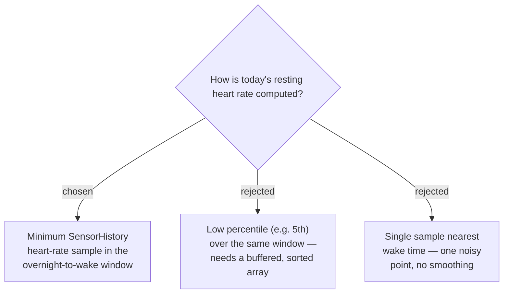

# Today's effective RHR is the minimum heart-rate sample in the overnight-to-wake window, not a UserProfile field

`UserProfile.Profile.restingHeartRate` was confirmed (2026-07-26, real fr165
hardware plus a Garmin staff reply on their own bug tracker) to reflect a
user-configured profile setting — it can stay `null` indefinitely even
though the watch is visibly computing and displaying a resting HR elsewhere.
This is documented Garmin behaviour, not a bug (see HANDOFF.md).

**Correction (`/scrutinize`, same day):** an earlier version of this ADR
claimed `averageRestingHeartRate` was equally unreliable. That was
overclaimed — Garmin's own API docs describe `averageRestingHeartRate` as
"calculated based on historical data," a computed value, not a manually
configured one, which is a materially different reliability claim than
`restingHeartRate`'s "as configured by the user." The on-device evidence
gathered only showed the *combined* RHR component absent
(`Components.fromRhr` returns `null` if either input is null) — it never
isolated which field was actually null. This ADR's replacement of *today's*
reading stands regardless (that field's unreliability is independently
confirmed), but see ADR 0017 for why the *baseline* replacement is
conditional on a still-pending on-device check.

The replacement reads `SensorHistory.getHeartRateHistory()` directly — the
same iterator-based API `Sensors.bodyBatteryAtWake()` already walks for Body
Battery — and takes the **minimum** bpm sample among whatever history the
buffer holds at or before `profile.wakeTime`. Deliberately **not** "strictly
from local midnight" — `bodyBatteryAtWake()`'s buffer-depth caveat
("undocumented but interrogable") is a bigger risk for heart rate, which is
sampled far more densely than Body Battery, so a same-capacity buffer likely
covers far fewer hours. Requiring the walk to reach all the way back to
midnight would make this return `null` far more often than intended,
undermining the whole point of the redesign. Instead: use whatever the
buffer covers, however far back that reaches — a partial night still
captures the low point during rest for most wake times, and using more
history (should the buffer reach further than expected) can only lower or
maintain the minimum, never distort it upward. Precision narrows gracefully
with a shallow buffer instead of the feature failing outright.

Chosen over a low percentile because a percentile needs the samples buffered
into an array to sort, which costs real memory in a background service whose
memory ceiling HANDOFF.md documents as unmeasured; a streaming minimum is
O(1). Chosen over a single sample nearest wake because one point sample can
catch a moment of movement right at waking, which minimum-over-window
smooths out.
