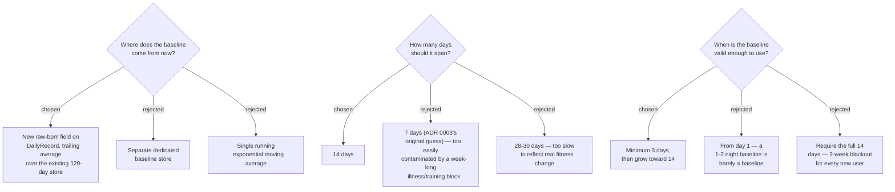

# RHR Baseline becomes a 14-day trailing average of our own stored raw RHR, active after a 3-day minimum

**Status: REJECTED (2026-07-26).** The pending on-device check this ADR was
conditional on came back: `MorningView` briefly printed
`Sensors.rhr()`/`Sensors.rhrBaseline()` raw values on a real fr165, and the
result was `rhr=null base=52`. `Profile.averageRestingHeartRate` **is**
reliably populated (52 bpm, a plausible real value) even though
`Profile.restingHeartRate` is null — confirming the two fields genuinely
differ in reliability, exactly as their doc wording ("as configured by the
user" vs. "calculated based on historical data") implied. This entire ADR is
voided: the app keeps reading `Profile.averageRestingHeartRate` for the
baseline, unchanged. Only ADR 0016 (today's RHR) ships. Kept below as the
historical record of what was designed and why it turned out unnecessary —
see ADR 0018 for how the schema/NowView decisions simplified once this was
dropped.

Original ADR (superseded)

Companion decision to ADR 0016: today's RHR is now derived locally
(overnight-minimum from `SensorHistory`), so the question is whether the
baseline it's compared against (ADR 0004's override) still needs to come
from `Profile.averageRestingHeartRate`, or should also move local. Garmin's
docs describe `averageRestingHeartRate` as "calculated based on historical
data" — a computed value, unlike `restingHeartRate`'s "as configured by the
user" — so its reliability is a genuinely open question, not an assumed
"same as the other field." Pending: check `profile.averageRestingHeartRate`
in isolation on the real device. Everything below is the design **if** it
does turn out unreliable there too.

**Storage:** `DailyRecord` gains a new raw-bpm field (alongside the existing
normalised RHR Component Score) and `RecordStore`'s existing 120-day retention
is reused directly — one store, no new persistence mechanism. Old
already-stored records simply lack the field; `RecordStore.fromStorable`
returns `null` for a missing key rather than throwing, and the baseline
average must treat a `null` raw-bpm entry as "skip this day," not as `0`.

**Window:** 14 days. Long enough that a multi-day illness or heavy training
block doesn't drag the baseline toward the elevated readings the override
exists to catch (rejected 7 days for this reason — matches the original
`averageRestingHeartRate` guess in ADR 0003, but a week-long illness is
exactly the contamination case), short enough to still track a real change in
base fitness within a few weeks (rejected 28-30 days as too slow).

**Bootstrap:** a minimum of 3 stored days is required before the average is
considered valid at all; between 3 and 14 days it averages whatever exists so
far. Below 3 days, RHR Baseline (and the override) is treated as absent —
same `UNCHECKED`-style handling as today, even though the day's raw RHR
reading itself is already known from day one.

## Consequences

- `CONTEXT.md`'s "RHR Baseline" glossary entry ("Read from
  `Profile.averageRestingHeartRate` rather than computed by the app") is now
  wrong and needs updating to describe the locally-computed trailing average.
- ADR 0003's "Unverified: the averaging window behind `averageRestingHeartRate`"
  and ADR 0004's two unverified-assumption notes are superseded — the window
  is no longer Garmin's undocumented choice, it's ours, named here.
- A `DailyRecord` written before this change has no raw-bpm field; the first
  ~3 days after upgrade effectively restart the baseline's bootstrap period
  even for an existing installation with a full 120-day store of the old shape.

