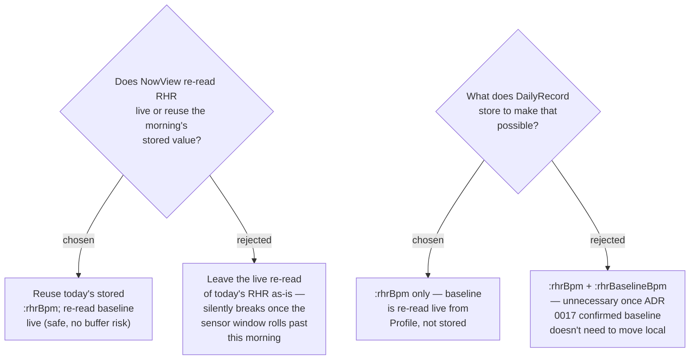

# NowView reuses today's stored raw RHR; DailyRecord gains one new field, not two

**Revised (2026-07-26)** after ADR 0017 was rejected — an on-device check
confirmed `Profile.averageRestingHeartRate` (the baseline) is reliable
(`base=52`), only `Profile.restingHeartRate` (today's spot value) is not.
That drops the need to store a baseline-at-capture value: baseline can still
be read live from `Sensors.rhrBaseline()` at any time of day, safely, since
it's a stable profile field with no sensor-history buffer to roll past. Only
today's RHR (ADR 0016's history-walk value) has that risk. So `DailyRecord`
needs exactly **one** new field, not two.

ADR 0010 already states RHR "is carried over unchanged from the same daily
value the Morning Score used" — true by construction under the old
`UserProfile.restingHeartRate` field (a stable value all day), but
`NowView.mc` actually re-calls `Sensors.rhr()` fresh each time rather than
reading the stored record, so the two coincided by accident rather than by
design. Under ADR 0016's history-walk algorithm for *today's RHR* this
accident stops being harmless: `SensorHistory`'s buffer depth is undocumented
(the same caveat `bodyBatteryAtWake()` already carries for Body Battery), so
a Now Score requested well into the evening could walk a buffer that has
already rolled past this morning's overnight window, returning a different
value or `null` — contradicting ADR 0010 for real, not just in wording.
NowView is changed to read today's already-captured `:rhrBpm` from
`RecordStore` instead of re-deriving it.

`Sensors.rhrBaseline()` itself is untouched by any of this — it still reads
`Profile.averageRestingHeartRate` directly, confirmed reliable, and NowView
can keep calling it live exactly as before, since a profile field has no
buffer to roll past. The override's bpm delta is computed as
`storedRhrBpm - Sensors.rhrBaseline()` wherever needed (Capture at capture
time, NowView later the same day) — nothing about the baseline half needs
persisting.

## Consequences

- `RecordStore.toStorable`/`fromStorable` (the Symbol<->String translation
  boundary) gain **one** new key mapping (`:rhrBpm`), not two.
- A record written before this change has no `:rhrBpm`; `NowView` on such a
  record must treat it as absent the same way missing RHR is already handled
  (`UNCHECKED`), not crash on a null subtraction.
- `Sensors.mc` keeps its role as raw hardware/profile reads only — unchanged
  by this ADR, since the baseline half no longer moves out of it.
