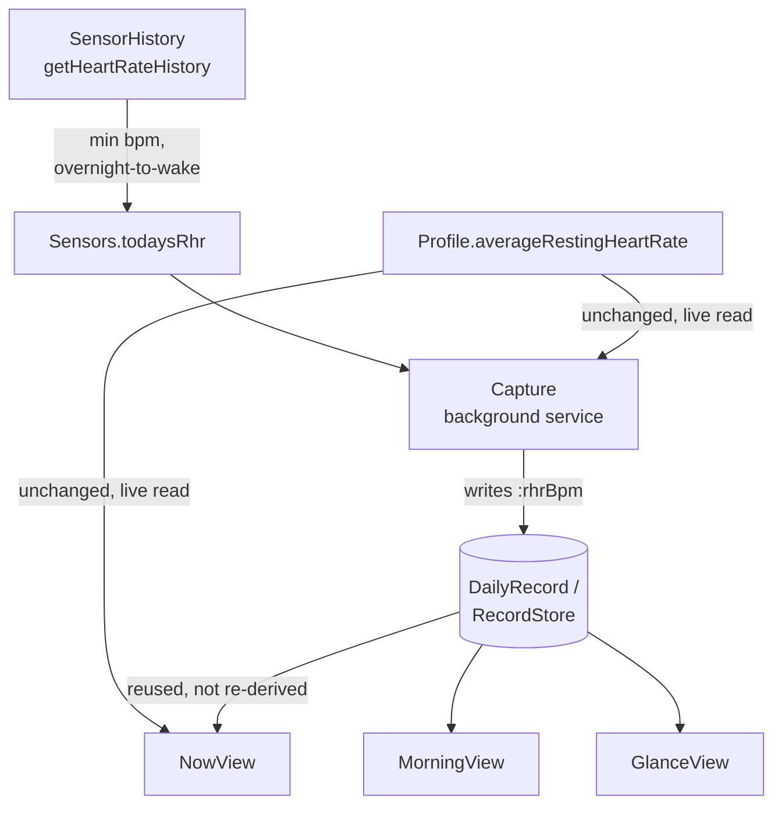
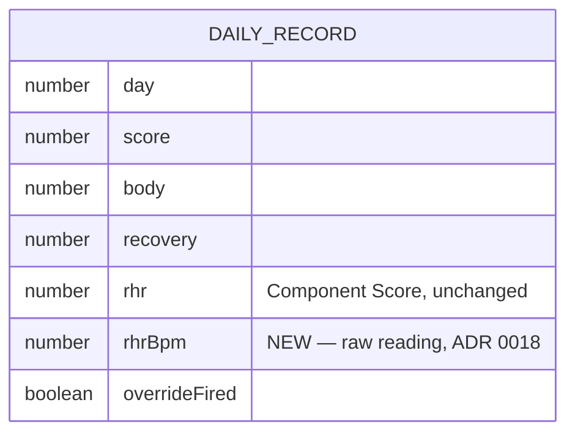
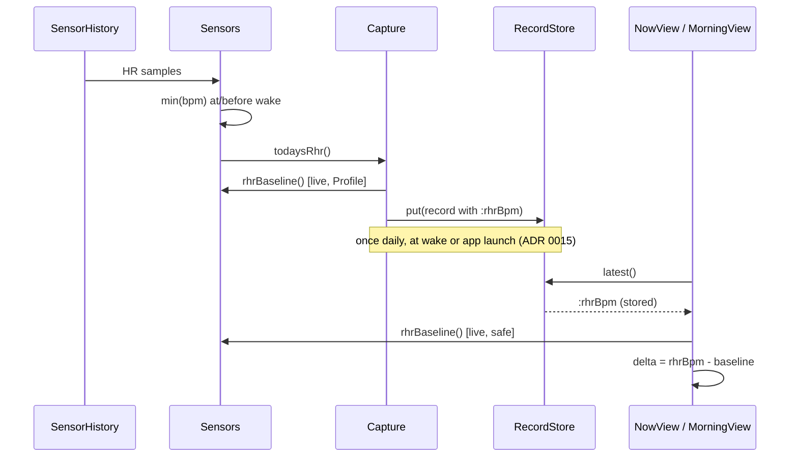

# RHR data source redesign — design spec



## Why this exists

`UserProfile.Profile.restingHeartRate` — the field the app has read for
Today's RHR since ADR 0003/0004 — was confirmed on real fr165 hardware
(2026-07-26) to reflect a user-configured profile setting that stays `null`
indefinitely for a user who has never manually confirmed a resting-HR value
in Garmin Connect, even though the watch is visibly computing and displaying
one elsewhere. Garmin staff confirm this is documented, working-as-designed
API behavior, not a bug (see HANDOFF.md and the linked Garmin bug report).
Under the app's existing graceful-degradation design (ADR 0005) this doesn't
crash anything — it just means the RHR Component Score, and the illness/
overreaching override built on it (ADR 0004), may never activate at all for
most real users.

A same-day `/scrutinize` pass caught that an earlier version of this
redesign wrongly assumed `Profile.averageRestingHeartRate` (the baseline)
was equally unreliable. An isolating on-device check (`rhr=null base=52`)
showed it is not — Garmin's docs describe it as "calculated based on
historical data," a genuinely different, computed field. So this redesign
is scoped to **only** today's RHR reading; the baseline is untouched.

## Scope

**In:** replacing `Sensors.rhr()`'s data source with a locally-derived value
from raw heart-rate sensor history; the `DailyRecord`/`RecordStore` schema
addition needed to let `NowView` reuse that value later in the day instead of
re-deriving it; the resulting `CONTEXT.md`/HANDOFF.md documentation updates.

**Out:** `Sensors.rhrBaseline()`, the RHR override thresholds and formula
(ADR 0004), the weights, `DisplayState`'s `UNCHECKED` handling, and the
Morning/Glance/Now views' rendering logic — none of these change.

**Rejected (kept as historical record):** a 14-day trailing baseline
computed from stored history, with its own bootstrap period (ADR 0017) —
unnecessary once the baseline field was confirmed reliable.

Terminology: see `CONTEXT.md`'s "Today's RHR" and "RHR Baseline" entries
(updated alongside this spec). Full decision history: ADR 0016 (accepted),
0017 (rejected), 0018 (accepted, revised).

---

## Today's RHR: overnight-minimum from raw sensor history

```mermaid
flowchart TD
    A[Capture.run fires] --> B[Sensors.todaysRhr]
    B --> C{SensorHistory.getHeartRateHistory<br/>available?}
    C -->|no| N1[return null]
    C -->|yes| D[Walk samples at/before<br/>profile.wakeTime]
    D --> E{Any samples found?}
    E -->|no| N2[return null]
    E -->|yes| F[Track running minimum<br/>O(1), no array]
    F --> G[Return minimum bpm]
```

`Sensors.rhr()` is replaced by a function (naming TBD by the implementation
plan, e.g. `todaysRhr()`) that walks `SensorHistory.getHeartRateHistory()`
the same way `bodyBatteryAtWake()` already walks `getBodyBatteryHistory()` —
same iterator style, same defensive null-checks. It takes the **minimum**
bpm sample among whatever history the buffer holds at or before
`profile.wakeTime`.

**Deliberately not "strictly from local midnight."** Heart rate is sampled
far more densely than Body Battery (continuous, often every few seconds
under 24/7 tracking), so a same-capacity buffer likely covers far fewer
hours — requiring the walk to reach all the way back to local midnight would
return `null` far more often than intended, defeating the point of this
redesign. Instead the walk uses whatever the buffer covers, however far back
that reaches. A partial night still captures the low point during rest for
most wake times; using more history, should the buffer reach further than
expected, can only lower or maintain the minimum, never distort it upward.
Precision narrows gracefully with a shallow buffer instead of the feature
failing outright.

Rejected alternatives (ADR 0016): a low percentile (needs a sorted, buffered
array — real memory cost given HANDOFF.md's unmeasured background/glance
memory ceiling) and a single sample nearest wake (one noisy point, no
smoothing).

## RHR Baseline: unchanged

`Sensors.rhrBaseline()` keeps reading `Profile.averageRestingHeartRate`
directly, exactly as today. No new storage, no window, no bootstrap period.
This was ADR 0017's entire proposal, rejected in full once the field was
confirmed populated on real hardware (`base=52`).

## NowView: reuse today's stored RHR, don't re-derive it

`NowView.mc` currently calls `Sensors.rhr()`/`Sensors.rhrBaseline()` fresh
every time it's shown. ADR 0010 already states RHR "is carried over
unchanged from the same daily value the Morning Score used" — true by
accident under the old stable profile field, but once today's RHR comes from
a sensor-history walk, re-deriving it later in the day risks the buffer
having rolled past this morning's window (returning a different value or
`null`, contradicting ADR 0010 for real). `NowView` is changed to read
today's already-captured value from `RecordStore` instead.

`Sensors.rhrBaseline()` is unaffected by this — it has no buffer to roll
past, so `NowView` keeps calling it live. The override's bpm delta is
computed as `storedRhrBpm - Sensors.rhrBaseline()` wherever it's needed
(`Capture` at capture time, `NowView` later the same day).

## Schema change



One new field, `:rhrBpm`, alongside the existing `:rhr` (normalised
Component Score — unchanged, still what the dials display). `RecordStore`'s
`toStorable`/`fromStorable` (the Symbol↔String `Storage` boundary,
`RecordStore.mc`) gain one more key mapping.

**Backward compatibility:** a `DailyRecord` written before this change has no
`:rhrBpm`. `fromStorable` returns `null` for a missing key rather than
throwing (existing behavior, unchanged), so `NowView` must treat a missing
`:rhrBpm` the same way missing RHR is already handled — `UNCHECKED`, not a
crash on a null subtraction.

---

## Runtime flow



## Consequences

- `CONTEXT.md`: "Today's RHR" now describes the sensor-derived value;
  "RHR Baseline" reverts to describing the (still Profile-sourced) baseline,
  correcting the brief incorrect claim that it too would move local.
- HANDOFF.md's unverified-assumptions section is updated: `restingHeartRate`'s
  unreliability is confirmed and being designed around; `averageRestingHeartRate`
  is confirmed populated, and only its averaging-window assumption remains
  open (unrelated to this redesign).
- Existing installations upgrading mid-history: their stored records simply
  lack `:rhrBpm` going forward until the next capture; no migration step
  needed given `fromStorable`'s existing null-tolerant behavior.
- Nothing about the override thresholds (7/12 bpm), the weights, or
  `DisplayState`'s state logic changes — this redesign is scoped to the data
  source only, not the scoring model.

## Related decisions

- [ADR 0016](../../adr/0016-effective-rhr-from-heart-rate-history.md) — Today's RHR from heart-rate history (accepted)
- [ADR 0017](../../adr/0017-rhr-baseline-from-stored-history.md) — RHR Baseline from stored history (**rejected**, kept as record)
- [ADR 0018](../../adr/0018-nowview-reuses-stored-rhr-not-live-reread.md) — NowView reuses stored RHR (accepted, revised)
