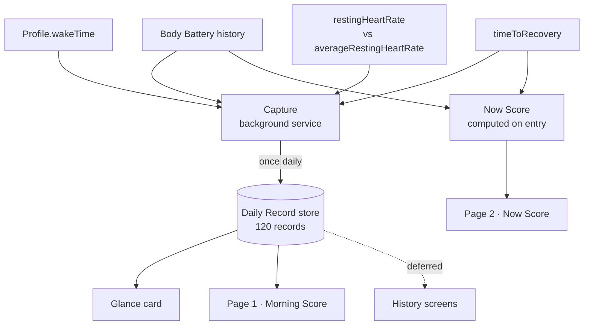
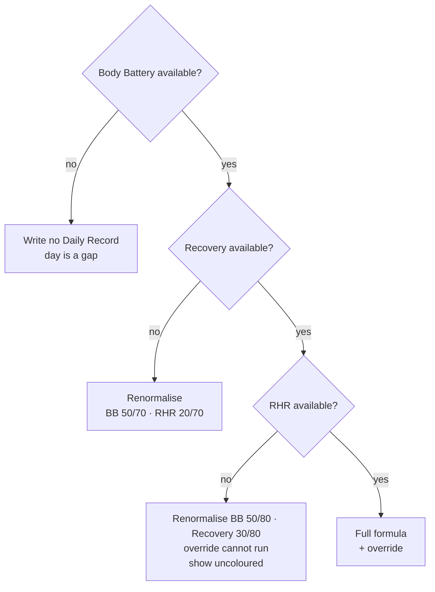
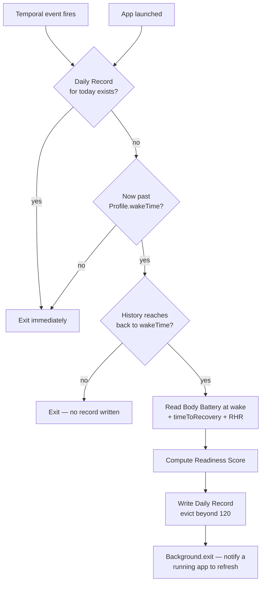
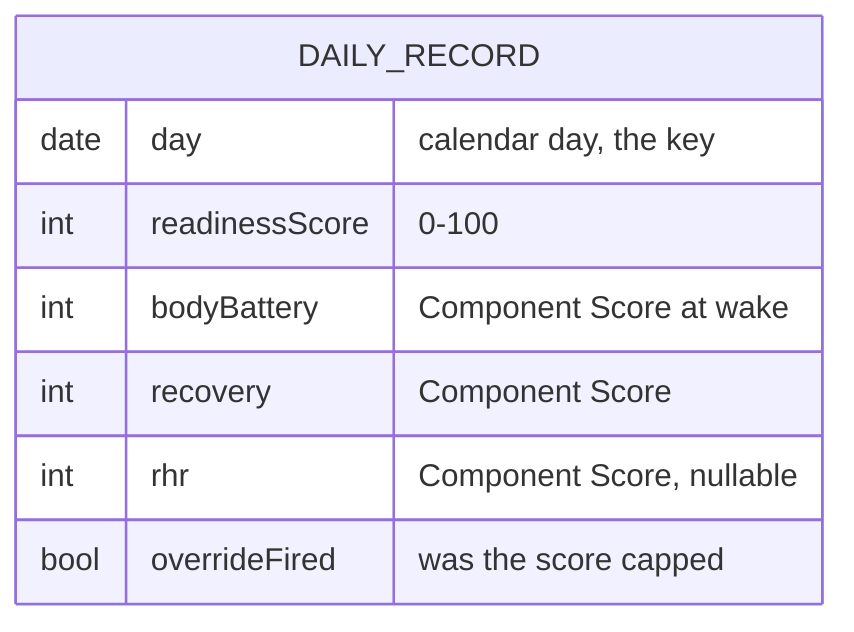

# SPReadyNess — design spec

A Garmin Connect IQ watch app for the Forerunner 165 that reports a daily
Readiness Score derived from the watch's own recovery metrics.



## Why this exists

The Forerunner 165 collects Body Battery, recovery time, resting heart rate and
stress, but — unlike the 265, 570, 965 and 970 — Garmin does not synthesise them
into a Training Readiness score on this model. SPReadyNess produces that missing
number on-watch, from data the device already has.

## Scope

**In v1:** the glance card, the Morning Score page, the Now Score page, the
background Capture, and the 120-record Daily Record store.

**Out of v1:** the 7-day, 30-day and 8-week history screens (ADR 0011). The store
that feeds them still runs, because a chart can be added later but the past cannot
be backfilled.

**Never:** SpO2 as a score input (ADR 0003). Any medical claim — this advises
training intensity, nothing more.

Terminology is defined in [`CONTEXT.md`](../../../CONTEXT.md). Visual tokens are in
[`docs/design-baseline.md`](../../design-baseline.md).

---

## The Readiness Score

Three inputs, each normalised to a 0–100 Component Score:

| Component | Source | API level | Normalisation |
|---|---|---|---|
| Body Battery | `SensorHistory.getBodyBatteryHistory()` | 3.3.0 | used directly |
| Recovery | `ActivityMonitor.Info.timeToRecovery` (hours) | 3.3.0 | `100 − (hours / 48 × 100)`, clamped |
| Resting HR | `UserProfile.Profile.restingHeartRate` vs `averageRestingHeartRate` | 1.0.0 / 3.2.0 | `100 − (delta_bpm × 8)`, clamped |

```
Readiness Score = 0.50 × BodyBattery + 0.30 × Recovery + 0.20 × RHR
```

**Override.** RHR at or above baseline + 7 bpm caps the score at 59; at or above
baseline + 12 bpm it caps at 39. Resting heart rate is a tripwire, not a slider — a
plain average would let a Body Battery of 85 bury the classic early signal of
illness (ADR 0004).

### Status Bands

| Band | Range | Colour |
|---|---|---|
| GO HARD | 80–100 | `#00E676` |
| READY | 60–79 | `#C6D62B` |
| GO EASY | 40–59 | `#FF9500` |
| REST | 0–39 | `#FF3B30` |

### Missing inputs



Renormalisation divides each surviving weight by their sum. The weights are given as
exact fractions rather than percentages: `50/80` is 62.5%, which rounds ambiguously
and must not be reimplemented as 62 in one place and 63 in another.

`timeToRecovery` of **zero is not missing data** — it means fully recovered and maps
to a Component Score of 100. Only a genuine null counts as absent. Conflating them
would penalise every rest day (ADR 0005).

Body Battery is treated as load-bearing rather than merely weighted: without it,
half the weight and the entire HRV/sleep/stress signal are gone, so what remains is
a different and weaker measurement, not a degraded one. No score is written.

---

## Capture

Runs as a background service on a **single repeating `Duration` temporal event of 30
minutes** — Connect IQ permits only one registration, and `registerForTemporalEvent`
overwrites any previous one.



**App launch is a second trigger**, not only the temporal event. A fresh install
that would otherwise sit inert until tomorrow instead attempts a Capture at once; if
the history still reaches back to this morning's wake it produces a real Morning Score
within seconds (ADR 0015). The "record for today exists?" guard makes the Capture
idempotent per day, so a launch racing the scheduled event is harmless.

`Background.exit()` is **not** a second persistence path — the record is already
written to Storage by then. Its only job is handing the score to an app that happens
to be running so it can refresh without re-reading.

Almost every firing costs two comparisons and an exit. Only the first firing after
wake does real work, so ~48 daily wakeups are far cheaper than the count suggests
(ADR 0012).

A one-shot `Moment` at `wakeTime` was rejected: a watch on the charger or powered off
at that instant loses the day, and because history cannot be backfilled, a missed
firing is permanent.

### Body Battery is resolved at wake, not at firing

The Capture fires up to 30 minutes after waking, but Body Battery begins draining
immediately. Reading the current value would bias every Morning Score low **by a
varying amount**, making scores incomparable across days — which corrupts the very
history the store exists to preserve.

So: resolve `Profile.wakeTime` to today's `Time.Moment`, then walk the Body Battery
iterator to the first sample at or after it. Before doing so, check
`getOldestSampleTime()` — if the buffer no longer reaches back to wake, write no
Daily Record rather than substituting a later sample. Buffer depth is undocumented
but **interrogable at runtime**, so the app asks rather than assumes (ADR 0013).

`Profile.wakeTime` is a configured setting, not observed wake. A wearer whose real
schedule differs sharply from their configured one gets a reading from the wrong
moment. Accepted: no observed wake time exists at API 5.2 (`upcomingWakeTime` is
6.0.0).

---

## Data



Roughly 25 bytes per record; 120 records is about 3 KB.

**Layout: one Storage value holding an array**, not 120 separate keys. Storage values
are capped at 32 KB, so a ~3 KB array fits comfortably in one, and oldest-first
eviction is a single read-modify-write rather than an enumeration over an unbounded
key space.

**Key: the device-local date at the moment of Capture.** A wearer crossing a timezone
may therefore produce a duplicate or a skipped day — accepted, because the
alternative (store UTC, reinterpret on display) relocates the same ambiguity somewhere
less visible. The Capture's "record for today exists?" guard uses this same local
date, so guard and key can never disagree.

**A Now Score is never written as a Daily Record.** Storing live evening scores
alongside morning ones would plot two incompatible measurements on one axis and make
any future chart meaningless (ADR 0010).

---

## Screens

**Mockup (approved):** https://claude.ai/code/artifact/f3d57d44-514f-427c-b691-760a61fcbb17
· source at [`docs/mockups/screens.html`](../../mockups/screens.html)

| Surface | Shows | Reached by |
|---|---|---|
| Glance card | Morning Score, band, gradient bar | swipe-up |
| Page 1 | Morning Score, 270° solid arc, three Component dials | app launch |
| Page 2 | Now Score, dashed arc, `NOW hh:mm`, three dials | `DOWN` from page 1 |

The Now Score is computed **once on entry to page 2**; paging down *is* the demand,
and the visible timestamp keeps it honest. Continuous recomputation was rejected as
battery spent animating a number that barely moves (ADR 0014).

The glance never shows a Now Score. A glance is passive — the wearer asked nothing,
so answering would present a drained evening Body Battery as a verdict.

### The Now Score reads two inputs, not three

`restingHeartRate` is a daily profile value and cannot change intraday. The Now Score
re-reads Body Battery and `timeToRecovery` only; RHR is carried over unchanged.

**The Now Score reads the _current_ Body Battery — not the at-wake value.** It must
not reuse the wake-resolution helper from the Capture; doing so would make the Now
Score identical to the Morning Score and defeat this feature entirely. The at-wake
resolution exists solely to keep stored Morning Scores comparable across days.

The consequence is accepted and deliberate: **Body Battery drains by the clock, not
by fatigue**, so a Now Score reads lower in the evening for reasons unrelated to
readiness — and lower the later it is asked. The Status Band thresholds were
calibrated against morning readings and are applied unchanged, which is part of why
it skews low (ADR 0010).

### The uncoloured state

Colour carries the recommendation, so a score the app cannot vouch for is shown
**without** it — grey, with a caption giving the reason:

| Condition | Caption |
|---|---|
| No Daily Record for today | its age, e.g. `2 DAYS AGO` |
| RHR absent, override never ran | `NO RHR — UNCHECKED` |

The number is still shown. Withholding it would discard useful information and make
the app feel broken on exactly the mornings it matters; the defect was never showing
stale data but showing it *unlabelled* (ADR 0009).

### The empty state — no record has ever existed

Distinct from both of the above and from a low score. A fresh install that could not
capture (installed at night, history no longer reaching that morning's wake) has **no
number to show at all** — there is no age to report and nothing to dim.

**No number, no arc fill, no colour. Caption: `FIRST SCORE TOMORROW MORNING`.**

A placeholder or a zero was rejected as indistinguishable from a genuine REST morning.
Showing a Now Score on page 1 instead was also rejected: the Morning/Now distinction
is what the design rests on, and blurring it on the app's very first screen teaches
the wrong model immediately. Page 2 already serves anyone wanting a number now
(ADR 0015).

---

## Constraints

Verified against Garmin's documentation:

- Forerunner 165 / 165 Music: 390 × 390 round AMOLED, **API level 5.2**.
- Temporal events cannot recur more often than **every 5 minutes**; only **one** may
  be registered at a time.
- `Background.exit()` payloads cap at **~8 KB** (`ExitDataSizeLimitException`). Exit
  data is delivered immediately if the app is running, otherwise saved for its next
  run, so a Capture is never lost to a closed app.
- `SensorHistory` reaches back only "to the last power cycle" / "most recent samples"
  — it cannot reproduce a past morning, which is why the app persists its own records.
- **Storage values cap at 32 KB each**; the total Object Store size "can vary between
  devices".
- **Background Storage writes require CIQ ≥ 3.2.0.** Below that, `Storage` throws
  `ObjectStoreAccessException` when called from a background process. The FR165
  satisfies this at 5.2, so the Capture may write directly — but any port to an older
  device must move the write into the foreground.
- The **Background** permission is required.

### Unverified — confirm before relying on

1. **Background process memory ceiling.** A 32 KB figure circulates in the community
   but is not in Garmin's docs. Confirm against the SDK before sizing the Capture.
2. **Glance memory ceiling.** Glances run under tighter limits than the app, and the
   glance both reads the store and draws a gradient bar. Not documented; confirm.
3. **Total Object Store budget on the FR165.** The 32 KB per-value cap is confirmed
   and is not the binding constraint at ~3 KB; the overall budget is still unmeasured.
4. **`averageRestingHeartRate` window.** Assumed multi-day. If short, the +7/+12
   thresholds compare today against something too close to today.
5. **`restingHeartRate` freshness.** Assumed to reflect the night just ended. If it
   lags a day, the override fires a day late.
6. **`Profile.wakeTime` return type.** Assumed convertible to today's `Time.Moment`;
   the exact type was not confirmed against the SDK.

Items 3 and 4 mean the override is **directionally right but not calibrated**. All
five formula constants — the 48-hour span, the ×8 slope, the two thresholds, the
three weights — are plausibility-chosen starting values, to be tuned once real Daily
Records exist. They must live as named constants, not inline literals.

## Testing

The store ships with **no reader in v1**, so a write or eviction defect would go
undetected for months while silently corrupting the one asset that cannot be rebuilt.
Unit tests over the Daily Record store are therefore the condition on which keeping
an unread store is justified (ADR 0011):

- write then read back a record
- the 120-record eviction boundary
- no-record-for-today → stale path
- **empty store → empty state**, distinct from both stale and a low score
- **launch-triggered Capture is idempotent** with the scheduled one for the same day
- `timeToRecovery` null vs zero produce different Component Scores
- each missing-input branch renormalises to the stated weights
- the override caps at 59 and 39 at the stated thresholds

## Decisions

| ADR | Decision |
|---|---|
| [0001](../../adr/0001-morning-snapshot-not-live-score.md) | Morning snapshot, not a live score |
| [0002](../../adr/0002-background-temporal-event-captures-daily-record.md) | Background temporal event captures the Daily Record |
| [0003](../../adr/0003-three-score-inputs-drop-spo2.md) | Three inputs; SpO2 excluded |
| [0004](../../adr/0004-weighted-average-with-rhr-override.md) | Weighted average with an RHR override |
| [0005](../../adr/0005-missing-input-handling.md) | Missing inputs redistribute; no Body Battery, no score |
| [0006](../../adr/0006-retain-120-daily-records-gaps-break-the-line.md) | Retain 120 records; gaps break the line |
| [0007](../../adr/0007-ship-all-five-screens-in-v1.md) | ~~All five screens~~ — superseded by 0011 |
| [0008](../../adr/0008-minimal-design-baseline.md) | Minimal design baseline |
| [0009](../../adr/0009-stale-scores-shown-but-marked.md) | Stale scores shown but marked |
| [0010](../../adr/0010-live-now-score-alongside-morning-score.md) | Live Now Score alongside the Morning Score |
| [0011](../../adr/0011-cut-history-screens-keep-the-store.md) | History screens cut; store kept |
| [0012](../../adr/0012-capture-schedule-coarse-duration-with-guard.md) | Guarded 30-minute Duration schedule |
| [0013](../../adr/0013-body-battery-resolved-at-wake-not-at-capture.md) | Body Battery resolved at wake |
| [0014](../../adr/0014-two-pages-now-score-computed-on-entry.md) | Two pages; Now Score computed on entry |
| [0015](../../adr/0015-first-run-attempts-an-immediate-capture.md) | First run attempts an immediate Capture |
